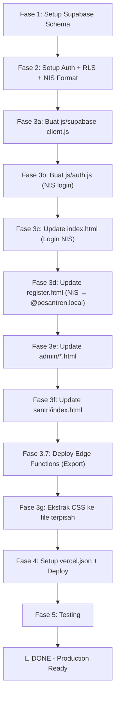

# 🚀 Migration Plan: Supabase + Vercel Deployment

> **Project:** Sistem Perizinan Santri — Pesantren Tanwirul Qulub  
> **Tanggal:** 3 April 2026  
> **Status:** ✅ Approved  
> **Dari:** PHP Native + MySQL (XAMPP localhost)  
> **Ke:** Vanilla JS + Supabase (BaaS) + Vercel (Hosting)

### ✅ Keputusan Final

| # | Keputusan | Detail |
|---|-----------|--------|
| 1 | **Login pakai NIS** | Format: `NIS@pesantren.local` (contoh: `12345667@pesantren.local`) — bukan email asli |
| 2 | **Export via Edge Functions** | Excel & PDF export dihandle oleh Supabase Edge Functions (Deno) |
| 3 | **Tanpa notifikasi** | Tidak perlu push notification |

---

## 📐 Arsitektur Baru

### Sebelum (Current)
```
Browser ──► Apache (XAMPP) ──► PHP API ──► MySQL
                 │
           Static HTML/CSS/JS
```

### Sesudah (Target)
```
Browser ──► Vercel (Static Hosting) ──► Supabase (BaaS)
    │                                        │
    ├── HTML/CSS/JS (Static Files)           ├── PostgreSQL Database
    └── supabase-js (Client Library)         ├── Auth (NIS@pesantren.local)
                                             ├── Row Level Security
                                             ├── Auto-generated REST API
                                             └── Edge Functions (Export Excel/PDF)
```

> **KEY DECISION:** Semua interaksi database dilakukan langsung via `supabase-js` dari browser (dilindungi RLS). Export Excel/PDF dihandle oleh **Supabase Edge Functions** (Deno runtime).

---

## 📋 Fase Migrasi

### Overview

| Fase | Deskripsi | Estimasi |
|------|-----------|----------|
| **Fase 1** | Setup Supabase Project & Schema | 1-2 jam |
| **Fase 2** | Migrasi Auth ke Supabase Auth (NIS-based) | 2-3 jam |
| **Fase 3** | Rewrite API calls ke supabase-js | 4-6 jam |
| **Fase 3.7** | Edge Functions (Export Excel/PDF) | 1-2 jam |
| **Fase 4** | Setup Vercel & Deploy | 30 menit |
| **Fase 5** | Testing & Polish | 1-2 jam |
| **Total** | | **~10-15 jam** |

---

## Fase 1: Setup Supabase — Database Schema

### 1.1 Buat Project Supabase
1. Buka [supabase.com](https://supabase.com) → New Project
2. Catat `Project URL` dan `anon key` dari Settings > API
3. Region: pilih **Southeast Asia (Singapore)** untuk latency terbaik

### 1.2 SQL Migration Script

Jalankan SQL berikut di **Supabase SQL Editor**. Ini adalah konversi dari MySQL schema ke PostgreSQL, disesuaikan dengan Supabase Auth:

```sql
-- ============================================
-- MIGRATION: MySQL pesantren → Supabase PostgreSQL
-- ============================================

-- =========================
-- TABEL: santri
-- =========================
CREATE TABLE IF NOT EXISTS public.santri (
  id_santri BIGINT GENERATED BY DEFAULT AS IDENTITY PRIMARY KEY,
  nis VARCHAR(20) UNIQUE NOT NULL,
  nama_santri VARCHAR(100) NOT NULL,
  jenis_kelamin VARCHAR(1) NOT NULL CHECK (jenis_kelamin IN ('L', 'P')),
  kelas VARCHAR(20) NOT NULL,
  status VARCHAR(10) DEFAULT 'aktif' CHECK (status IN ('aktif', 'nonaktif')),
  created_at TIMESTAMPTZ DEFAULT NOW(),
  updated_at TIMESTAMPTZ DEFAULT NOW()
);

-- =========================
-- TABEL: admin_profiles
-- Linked ke Supabase Auth (auth.users)
-- =========================
CREATE TABLE IF NOT EXISTS public.admin_profiles (
  id UUID PRIMARY KEY REFERENCES auth.users(id) ON DELETE CASCADE,
  username VARCHAR(50) UNIQUE NOT NULL,
  nama_admin VARCHAR(100),
  role VARCHAR(20) DEFAULT 'admin' CHECK (role = 'admin'),
  created_at TIMESTAMPTZ DEFAULT NOW()
);

-- =========================
-- TABEL: santri_profiles
-- Linked ke Supabase Auth (auth.users)
-- =========================
CREATE TABLE IF NOT EXISTS public.santri_profiles (
  id UUID PRIMARY KEY REFERENCES auth.users(id) ON DELETE CASCADE,
  id_santri BIGINT REFERENCES public.santri(id_santri) ON DELETE CASCADE,
  username VARCHAR(50) UNIQUE NOT NULL,
  role VARCHAR(20) DEFAULT 'santri' CHECK (role = 'santri'),
  created_at TIMESTAMPTZ DEFAULT NOW()
);

-- =========================
-- TABEL: izin
-- =========================
CREATE TABLE IF NOT EXISTS public.izin (
  id_izin BIGINT GENERATED BY DEFAULT AS IDENTITY PRIMARY KEY,
  id_santri BIGINT NOT NULL REFERENCES public.santri(id_santri) ON DELETE CASCADE,
  jenis_izin VARCHAR(20) NOT NULL CHECK (jenis_izin IN ('sakit', 'acara_keluarga', 'pulang', 'keluar', 'lainnya')),
  tanggal_keluar TIMESTAMPTZ NOT NULL,
  batas_waktu TIMESTAMPTZ,
  tanggal_kembali TIMESTAMPTZ,
  alasan TEXT,
  status VARCHAR(15) DEFAULT 'menunggu' CHECK (status IN ('menunggu', 'disetujui', 'ditolak')),
  status_kembali VARCHAR(15) CHECK (status_kembali IN ('tepat_waktu', 'terlambat')),
  created_at TIMESTAMPTZ DEFAULT NOW(),
  updated_at TIMESTAMPTZ DEFAULT NOW()
);

-- =========================
-- FUNCTION: auto update updated_at
-- =========================
CREATE OR REPLACE FUNCTION public.handle_updated_at()
RETURNS TRIGGER AS $$
BEGIN
  NEW.updated_at = NOW();
  RETURN NEW;
END;
$$ LANGUAGE plpgsql;

-- Trigger untuk santri
CREATE TRIGGER on_santri_updated
  BEFORE UPDATE ON public.santri
  FOR EACH ROW EXECUTE FUNCTION public.handle_updated_at();

-- Trigger untuk izin
CREATE TRIGGER on_izin_updated
  BEFORE UPDATE ON public.izin
  FOR EACH ROW EXECUTE FUNCTION public.handle_updated_at();

-- =========================
-- INDEX untuk performa query
-- =========================
CREATE INDEX idx_izin_id_santri ON public.izin(id_santri);
CREATE INDEX idx_izin_status ON public.izin(status);
CREATE INDEX idx_izin_tanggal ON public.izin(tanggal_keluar DESC);
CREATE INDEX idx_santri_nis ON public.santri(nis);
CREATE INDEX idx_santri_profiles_id_santri ON public.santri_profiles(id_santri);
```

### 1.3 Perbedaan MySQL → PostgreSQL

| MySQL | PostgreSQL (Supabase) | Catatan |
|-------|----------------------|---------|
| `INT AUTO_INCREMENT` | `BIGINT GENERATED BY DEFAULT AS IDENTITY` | PostgreSQL standard |
| `ENUM('L','P')` | `VARCHAR + CHECK constraint` | PostgreSQL tidak punya ENUM out of the box di Supabase |
| `TIMESTAMP DEFAULT CURRENT_TIMESTAMP` | `TIMESTAMPTZ DEFAULT NOW()` | Timezone-aware |
| `ON UPDATE CURRENT_TIMESTAMP` | Trigger function `handle_updated_at()` | Perlu trigger manual |
| Tabel `admin` + `akun_santri` | `admin_profiles` + `santri_profiles` → linked ke `auth.users` | Supabase Auth menangani login |

### 1.4 Seed Data (Data Awal)

```sql
-- Insert data santri awal
INSERT INTO public.santri (nis, nama_santri, jenis_kelamin, kelas) VALUES
  ('12345667', 'Fadlia Nur Azizah', 'P', 'Ula'),
  ('12345668', 'Deden Ramdhan', 'L', 'Ulya'),
  ('12345669', 'Naila Sahru N', 'P', 'Wustho');
```

> **CATATAN:** Akun admin dan santri akan dibuat melalui **Supabase Auth** (Fase 2), bukan via INSERT manual. Profile record akan dibuat otomatis via trigger.

---

## Fase 2: Migrasi Auth ke Supabase Auth

### 2.1 Perbedaan Sistem Auth

| Aspek | Sebelum (PHP) | Sesudah (Supabase) |
|-------|--------------|-------------------|
| **Identifier** | Username / NIS | NIS@pesantren.local (fake email) |
| Login | POST ke `api/auth/login.php` → cek manual | `supabase.auth.signInWithPassword({ email: NIS@pesantren.local })` |
| Register | POST ke `api/auth/register.php` → INSERT manual | `supabase.auth.signUp({ email: NIS@pesantren.local })` + trigger |
| Session | `$_SESSION` + `localStorage` | Supabase managed (JWT + refresh token) |
| Password | bcrypt manual | Supabase Auth otomatis (bcrypt) |
| Logout | `session_destroy()` | `supabase.auth.signOut()` |

> **NIS-based Login:** Santri login pakai NIS sebagai username. Di belakang layar, NIS dikonversi ke format email: `{NIS}@pesantren.local`. Admin login pakai username yang juga dikonversi: `{username}@pesantren.local`. Supabase memerlukan format email, tapi email ini tidak perlu benar-benar ada — hanya sebagai identifier.

### 2.2 Trigger: Auto-Create Profile

```sql
-- Trigger untuk membuat admin_profiles saat signup admin
CREATE OR REPLACE FUNCTION public.handle_new_admin()
RETURNS TRIGGER AS $$
BEGIN
  IF NEW.raw_user_meta_data->>'role' = 'admin' THEN
    INSERT INTO public.admin_profiles (id, username, nama_admin, role)
    VALUES (
      NEW.id,
      NEW.email,
      COALESCE(NEW.raw_user_meta_data->>'nama', NEW.email),
      'admin'
    );
  END IF;
  RETURN NEW;
END;
$$ LANGUAGE plpgsql SECURITY DEFINER;

-- Trigger untuk membuat santri_profiles saat signup santri
CREATE OR REPLACE FUNCTION public.handle_new_santri()
RETURNS TRIGGER AS $$
BEGIN
  IF NEW.raw_user_meta_data->>'role' = 'santri' THEN
    INSERT INTO public.santri_profiles (id, id_santri, username, role)
    VALUES (
      NEW.id,
      (NEW.raw_user_meta_data->>'id_santri')::BIGINT,
      NEW.email,
      'santri'
    );
  END IF;
  RETURN NEW;
END;
$$ LANGUAGE plpgsql SECURITY DEFINER;

-- Single trigger yang handle kedua kasus
CREATE OR REPLACE FUNCTION public.handle_new_user()
RETURNS TRIGGER AS $$
BEGIN
  IF NEW.raw_user_meta_data->>'role' = 'admin' THEN
    INSERT INTO public.admin_profiles (id, username, nama_admin, role)
    VALUES (
      NEW.id,
      NEW.email,
      COALESCE(NEW.raw_user_meta_data->>'nama', NEW.email),
      'admin'
    );
  ELSIF NEW.raw_user_meta_data->>'role' = 'santri' THEN
    INSERT INTO public.santri_profiles (id, id_santri, username, role)
    VALUES (
      NEW.id,
      (NEW.raw_user_meta_data->>'id_santri')::BIGINT,
      NEW.email,
      'santri'
    );
  END IF;
  RETURN NEW;
END;
$$ LANGUAGE plpgsql SECURITY DEFINER;

CREATE TRIGGER on_auth_user_created
  AFTER INSERT ON auth.users
  FOR EACH ROW EXECUTE FUNCTION public.handle_new_user();
```

### 2.3 Row Level Security (RLS) Policies

```sql
-- =====================
-- RLS: santri
-- =====================
ALTER TABLE public.santri ENABLE ROW LEVEL SECURITY;

-- Admin bisa lihat & kelola semua santri
CREATE POLICY "Admin can view all santri" ON public.santri
  FOR SELECT USING (
    EXISTS (SELECT 1 FROM public.admin_profiles WHERE id = (SELECT auth.uid()))
  );

CREATE POLICY "Admin can insert santri" ON public.santri
  FOR INSERT WITH CHECK (
    EXISTS (SELECT 1 FROM public.admin_profiles WHERE id = (SELECT auth.uid()))
  );

CREATE POLICY "Admin can update santri" ON public.santri
  FOR UPDATE USING (
    EXISTS (SELECT 1 FROM public.admin_profiles WHERE id = (SELECT auth.uid()))
  );

CREATE POLICY "Admin can delete santri" ON public.santri
  FOR DELETE USING (
    EXISTS (SELECT 1 FROM public.admin_profiles WHERE id = (SELECT auth.uid()))
  );

-- Santri bisa lihat data diri sendiri
CREATE POLICY "Santri can view own data" ON public.santri
  FOR SELECT USING (
    id_santri IN (
      SELECT sp.id_santri FROM public.santri_profiles sp WHERE sp.id = (SELECT auth.uid())
    )
  );

-- Anon user bisa lihat (untuk halaman register - lihat daftar santri)
CREATE POLICY "Anon can view santri for registration" ON public.santri
  FOR SELECT TO anon USING (true);

-- =====================
-- RLS: izin
-- =====================
ALTER TABLE public.izin ENABLE ROW LEVEL SECURITY;

-- Admin bisa lihat semua izin
CREATE POLICY "Admin can view all izin" ON public.izin
  FOR SELECT USING (
    EXISTS (SELECT 1 FROM public.admin_profiles WHERE id = (SELECT auth.uid()))
  );

-- Admin bisa update izin (setujui/tolak)
CREATE POLICY "Admin can update izin" ON public.izin
  FOR UPDATE USING (
    EXISTS (SELECT 1 FROM public.admin_profiles WHERE id = (SELECT auth.uid()))
  );

-- Santri bisa lihat izin sendiri
CREATE POLICY "Santri can view own izin" ON public.izin
  FOR SELECT USING (
    id_santri IN (
      SELECT sp.id_santri FROM public.santri_profiles sp WHERE sp.id = (SELECT auth.uid())
    )
  );

-- Santri bisa buat izin sendiri
CREATE POLICY "Santri can insert own izin" ON public.izin
  FOR INSERT WITH CHECK (
    id_santri IN (
      SELECT sp.id_santri FROM public.santri_profiles sp WHERE sp.id = (SELECT auth.uid())
    )
  );

-- Santri bisa update izin sendiri (untuk konfirmasi kembali)
CREATE POLICY "Santri can update own izin" ON public.izin
  FOR UPDATE USING (
    id_santri IN (
      SELECT sp.id_santri FROM public.santri_profiles sp WHERE sp.id = (SELECT auth.uid())
    )
  );

-- =====================
-- RLS: admin_profiles
-- =====================
ALTER TABLE public.admin_profiles ENABLE ROW LEVEL SECURITY;

CREATE POLICY "Admin can view own profile" ON public.admin_profiles
  FOR SELECT USING ((SELECT auth.uid()) = id);

-- =====================
-- RLS: santri_profiles
-- =====================
ALTER TABLE public.santri_profiles ENABLE ROW LEVEL SECURITY;

CREATE POLICY "Users can view own santri profile" ON public.santri_profiles
  FOR SELECT USING ((SELECT auth.uid()) = id);

CREATE POLICY "Admin can view all santri profiles" ON public.santri_profiles
  FOR SELECT USING (
    EXISTS (SELECT 1 FROM public.admin_profiles WHERE id = (SELECT auth.uid()))
  );
```

### 2.4 Buat Akun Admin Pertama

Setelah schema dan RLS siap, buat akun admin via Supabase Dashboard:

1. Buka **Authentication > Users > Add User**
2. Email: `admin@pesantren.local`, Password: `admin123` (ganti nanti!)
3. Tambahkan metadata: `{"role": "admin", "nama": "Admin Utama"}`
4. Matikan **Confirm Email** di Authentication > Settings agar tidak perlu verifikasi email (karena pakai fake email)

---

## Fase 3: Rewrite Frontend — PHP API → supabase-js

### 3.1 Setup Supabase Client

Buat file `js/supabase-client.js`:

```javascript
import { createClient } from 'https://esm.sh/@supabase/supabase-js@2'

const SUPABASE_URL = 'https://YOUR_PROJECT_ID.supabase.co'
const SUPABASE_ANON_KEY = 'YOUR_ANON_KEY'

export const supabase = createClient(SUPABASE_URL, SUPABASE_ANON_KEY)
```

> Menggunakan **ES Modules** dengan CDN `esm.sh` sehingga tidak perlu build tools/bundler.

### 3.2 Mapping API Lama → Supabase JS

Setiap file PHP API akan diganti dengan panggilan `supabase-js` langsung dari browser:

#### Auth Module

| PHP (Lama) | Supabase JS (Baru) |
|------------|-------------------|
| `api/auth/login.php` | `supabase.auth.signInWithPassword({ email: NIS + '@pesantren.local', password })` |
| `api/auth/register.php` | `supabase.auth.signUp({ email: NIS + '@pesantren.local', password, options: { data: { role: 'santri', id_santri } } })` |
| `api/auth/logout.php` | `supabase.auth.signOut()` |
| `api/auth/cek-session.php` | `supabase.auth.getSession()` |
| `api/auth/get-santri.php` | `supabase.from('santri').select('*').not('id_santri', 'in', existingIds)` |

#### Admin Module

| PHP (Lama) | Supabase JS (Baru) |
|------------|-------------------|
| `api/admin/dashboard.php` | Multiple `.select().count()` queries |
| `api/admin/santri.php` | `supabase.from('santri').select('*')` |
| `api/admin/tambah-santri.php` | `supabase.from('santri').insert({...})` |
| `api/admin/edit-santri.php` | `supabase.from('santri').update({...}).eq('id_santri', id)` |
| `api/admin/hapus-santri.php` | `supabase.from('santri').delete().eq('id_santri', id)` |
| `api/admin/izin-pending.php` | `supabase.from('izin').select('*, santri(*)').eq('status', 'menunggu')` |
| `api/admin/proses-izin.php` | `supabase.from('izin').update({ status }).eq('id_izin', id)` |
| `api/admin/monitoring.php` | `supabase.from('izin').select('*, santri(*)').eq('status', 'disetujui')` |
| `api/admin/rekap.php` | `supabase.from('izin').select('*, santri(*)').order('tanggal_keluar', { ascending: false })` |
| `api/admin/konfirmasi-kembali.php` | `supabase.from('izin').update({ tanggal_kembali, status_kembali }).eq('id_izin', id)` |

#### Santri Module

| PHP (Lama) | Supabase JS (Baru) |
|------------|-------------------|
| `api/santri/proses-izin.php` | `supabase.from('izin').insert({ id_santri, jenis_izin, tanggal_keluar, alasan })` |
| `api/santri/izin.php` | `supabase.from('izin').select('*').eq('id_santri', myId).order('created_at', { ascending: false })` |
| `api/santri/kembali.php` | `supabase.from('izin').update({ tanggal_kembali: new Date(), status_kembali }).eq('id_izin', id)` |

### 3.3 Contoh Implementasi — Login

**Sebelum (PHP):**
```javascript
// index.html - inline script
const response = await fetch('api/auth/login.php', {
  method: 'POST',
  headers: { 'Content-Type': 'application/json' },
  body: JSON.stringify({ username, password })
});
const result = await response.json();
if (result.success) {
  localStorage.setItem('user', JSON.stringify(result.data));
}
```

**Sesudah (Supabase) — Login pakai NIS:**
```javascript
// index.html - menggunakan supabase-js
import { supabase } from './js/supabase-client.js'

// Konversi NIS/username → fake email format
const email = `${username}@pesantren.local`

const { data, error } = await supabase.auth.signInWithPassword({
  email: email,
  password: password
})

if (error) {
  showNotification('error', 'NIS atau password salah')
  return
}

if (data.user) {
  // Session otomatis dikelola oleh supabase-js
  const role = data.user.user_metadata.role
  if (role === 'admin') {
    window.location.href = 'admin/index.html'
  } else {
    window.location.href = 'santri/index.html'
  }
}
```

### 3.3b Contoh Implementasi — Register Santri

```javascript
// register.html - menggunakan supabase-js
import { supabase } from './js/supabase-client.js'

const nis = document.getElementById('username').value  // santri input NIS
const password = document.getElementById('password').value
const id_santri = document.getElementById('id_santri').value

const email = `${nis}@pesantren.local`

const { data, error } = await supabase.auth.signUp({
  email: email,
  password: password,
  options: {
    data: {
      role: 'santri',
      id_santri: parseInt(id_santri),
      nis: nis
    }
  }
})

if (data.user) {
  showNotification('success', 'Pendaftaran berhasil! Silakan login.')
}
```

### 3.4 Contoh Implementasi — Dashboard Stats

**Sesudah (Supabase):**
```javascript
import { supabase } from '../js/supabase-client.js'

async function loadDashboard() {
  // Total santri
  const { count: totalSantri } = await supabase
    .from('santri')
    .select('*', { count: 'exact', head: true })

  // Izin pending
  const { count: izinPending } = await supabase
    .from('izin')
    .select('*', { count: 'exact', head: true })
    .eq('status', 'menunggu')

  // Izin terlambat
  const { count: izinTelat } = await supabase
    .from('izin')
    .select('*', { count: 'exact', head: true })
    .eq('status_kembali', 'terlambat')

  return { totalSantri, izinPending, izinTelat }
}
```

### 3.5 Struktur File Baru

```
santri_fitri/
│
├── index.html                    # Login page (NIS-based login)
├── register.html                 # Register page (NIS → @pesantren.local)
├── vercel.json                   # ⭐ Vercel config
├── package.json                  # ⭐ Untuk dependency (optional)
│
├── js/                           # ⭐ NEW - Shared JavaScript
│   ├── supabase-client.js        # Supabase client init
│   ├── auth.js                   # Auth helpers (NIS login, register, logout, guard)
│   └── utils.js                  # Utility functions (toast, popup, format date)
│
├── css/                          # ⭐ NEW - Extracted CSS
│   ├── global.css                # Shared styles (reset, typography, buttons)
│   ├── admin.css                 # Admin-specific styles
│   └── santri.css                # Santri-specific styles
│
├── assets/
│   └── img/
│       ├── logo.png
│       └── santri.png
│
├── admin/                        # Admin pages (updated HTML, no PHP calls)
│   ├── index.html
│   ├── kelola-santri.html
│   ├── tambah-santri.html
│   ├── edit-santri.html
│   ├── konfirmasi.html
│   ├── monitoring.html
│   └── rekap.html
│
├── santri/                       # Santri pages (updated HTML, no PHP calls)
│   └── index.html
│
├── supabase/                     # ⭐ NEW - Supabase Edge Functions
│   └── functions/
│       ├── export-excel/
│       │   └── index.ts          # Edge Function: Export data ke Excel
│       └── export-pdf/
│           └── index.ts          # Edge Function: Export data ke PDF
│
├── docs/                         # Dokumentasi
│   ├── project-review.md
│   └── migration-plan.md         # File ini
│
└── database/                     # SQL scripts (referensi)
    ├── pesantren.sql              # Schema lama (MySQL)
    └── supabase-migration.sql    # ⭐ Schema baru (PostgreSQL)
```

### 3.6 Files yang Dihapus

Semua file PHP **tidak lagi diperlukan** setelah migrasi:

```
❌ HAPUS:
├── login.php                     # Diganti supabase.auth
├── login.js                      # Diganti js/auth.js
├── style.css                     # Diganti css/global.css
├── test-db.php                   # Tidak perlu
├── .htaccess                     # Tidak perlu (Vercel punya routing sendiri)
│
├── api/                          # SELURUH FOLDER API DIHAPUS
│   ├── config/database.php
│   ├── auth/*.php
│   ├── admin/*.php
│   ├── santri/*.php
│   └── check-session.php
│
├── admin/admin-test.html         # File test
└── santri/santri-test.html       # File test
```

---

## Fase 4: Setup Vercel & Deploy

### 4.1 Vercel Project Configuration

Buat file `vercel.json` di root project:

```json
{
  "$schema": "https://openapi.vercel.sh/vercel.json",
  "buildCommand": null,
  "outputDirectory": ".",
  "rewrites": [
    { "source": "/admin/:path*", "destination": "/admin/:path*" },
    { "source": "/santri/:path*", "destination": "/santri/:path*" }
  ],
  "headers": [
    {
      "source": "/(.*)",
      "headers": [
        { "key": "X-Content-Type-Options", "value": "nosniff" },
        { "key": "X-Frame-Options", "value": "DENY" },
        { "key": "X-XSS-Protection", "value": "1; mode=block" }
      ]
    }
  ]
}
```

### 4.2 Environment Variables

Set di Vercel Dashboard → Project Settings → Environment Variables:

| Variable | Value | Env |
|----------|-------|-----|
| `VITE_SUPABASE_URL` | `https://xxx.supabase.co` | All |
| `VITE_SUPABASE_ANON_KEY` | `eyJhbG...` | All |

> **Catatan:** Karena ini static site (vanilla JS), environment variables akan di-hardcode di `supabase-client.js`. `ANON_KEY` aman untuk di-expose karena RLS melindungi data.

### 4.3 Deploy ke Vercel

#### Opsi A: Via Vercel CLI
```bash
# Install Vercel CLI
npm i -g vercel

# Login
vercel login

# Deploy dari root project
cd santri_fitri
vercel

# Follow prompts, set:
# - Framework: Other
# - Build command: (kosong)
# - Output directory: .
# - Install command: (kosong)

# Deploy ke production
vercel --prod
```

#### Opsi B: Via GitHub Integration (Recommended)
1. Push project ke **GitHub repository**
2. Buka [vercel.com](https://vercel.com) → **Add New Project**
3. Import repository dari GitHub
4. Setting:
   - Framework Preset: **Other**
   - Build Command: _(leave empty)_
   - Output Directory: `.`
5. Add Environment Variables
6. Click **Deploy**

> Setiap push ke `main` branch akan auto-deploy. 🎉

### 4.4 Custom Domain (Opsional)

1. Vercel Dashboard → Project → Settings → Domains
2. Add domain: `perizinan.pesantren-tq.id` (contoh)
3. Update DNS records sesuai instruksi Vercel
4. SSL/HTTPS otomatis

---

## Fase 5: Testing & Verification

### 5.1 Checklist Testing

| # | Test Case | Expected |
|---|-----------|----------|
| 1 | Buka halaman login | ✅ Tampil form login |
| 2 | Login sebagai admin | ✅ Redirect ke admin/index.html |
| 3 | Login sebagai santri | ✅ Redirect ke santri/index.html |
| 4 | Login salah password | ✅ Tampil error message |
| 5 | Register akun santri | ✅ Akun terdaftar di Supabase Auth |
| 6 | Admin: Lihat dashboard stats | ✅ Tampil total santri, izin pending, terlambat |
| 7 | Admin: Tambah santri | ✅ Data masuk ke tabel santri |
| 8 | Admin: Edit santri | ✅ Data terupdate |
| 9 | Admin: Hapus santri | ✅ Data terhapus (cascade) |
| 10 | Admin: Konfirmasi izin (setujui) | ✅ Status berubah ke 'disetujui' |
| 11 | Admin: Konfirmasi izin (tolak) | ✅ Status berubah ke 'ditolak' |
| 12 | Admin: Monitoring izin | ✅ Tampil daftar izin yang disetujui |
| 13 | Admin: Rekap perizinan | ✅ Tampil seluruh data rekap |
| 14 | Admin: Konfirmasi kembali | ✅ status_kembali updated |
| 15 | Santri: Ajukan izin | ✅ Izin masuk dengan status 'menunggu' |
| 16 | Santri: Lihat riwayat | ✅ Tampil daftar izin sendiri |
| 17 | Santri: Konfirmasi kembali | ✅ tanggal_kembali & status_kembali updated |
| 18 | Santri: Akses data admin | ❌ Blocked oleh RLS |
| 19 | Logout | ✅ Session dihapus, redirect ke login |
| 20 | Akses tanpa login | ✅ Redirect ke login |

### 5.2 Security Verification

- [ ] RLS aktif di semua tabel
- [ ] Santri tidak bisa lihat data santri lain
- [ ] Santri tidak bisa approve/reject izin
- [ ] Anon user hanya bisa akses halaman login/register
- [ ] CORS hanya mengizinkan domain Vercel

---

## 📊 Perbandingan Sebelum vs Sesudah

| Aspek | Sebelum | Sesudah |
|-------|---------|---------|
| **Hosting** | XAMPP localhost | Vercel (Global CDN) |
| **Database** | MySQL lokal | Supabase PostgreSQL (Cloud) |
| **Backend** | PHP Native (19 file) | Edge Functions (Export only) |
| **Auth** | Session + localStorage | Supabase Auth (JWT) — NIS-based |
| **Login Format** | Username/NIS manual | `NIS@pesantren.local` |
| **Security** | Manual escape string | RLS + Supabase policies |
| **Export** | Client-side (jsPDF) | Supabase Edge Functions (Deno) |
| **Deployment** | Manual upload | Git push auto-deploy |
| **SSL** | Tidak ada | ✅ Otomatis |
| **Cost** | XAMPP (free) | Supabase Free Tier + Vercel Free |
| **Scalability** | Single server | Auto-scaling cloud |
| **File Count** | 37 files | ~20 files (tanpa PHP) |

---

## ⚠️ Hal yang Perlu Diperhatikan

### Breaking Changes
1. **Login Format Berubah**: Santri login pakai **NIS** (bukan email asli). Di backend dikonversi ke `NIS@pesantren.local`. Admin login pakai **username** → `username@pesantren.local`.
2. **Data Migration**: Data dummy dari `pesantren.sql` perlu di-insert ulang ke Supabase.
3. **Offline Mode**: Tidak tersedia — aplikasi membutuhkan koneksi internet.
4. **Email Confirmation**: Harus dimatikan di Supabase Auth Settings karena pakai fake email.
5. **Export**: Berubah dari client-side ke Edge Functions — memerlukan internet.

### Supabase Auth Settings yang Perlu Diubah
1. **Authentication > Settings > Email**:
   - ❌ Matikan "Enable email confirmations"
   - ❌ Matikan "Double confirm email changes"
2. **Authentication > Settings > General**:
   - Set minimum password length: `6`

---

## 🔄 Urutan Eksekusi



---

> **Status: ✅ APPROVED** — Siap eksekusi. Mulai dari menjalankan SQL migration di Supabase SQL Editor.
