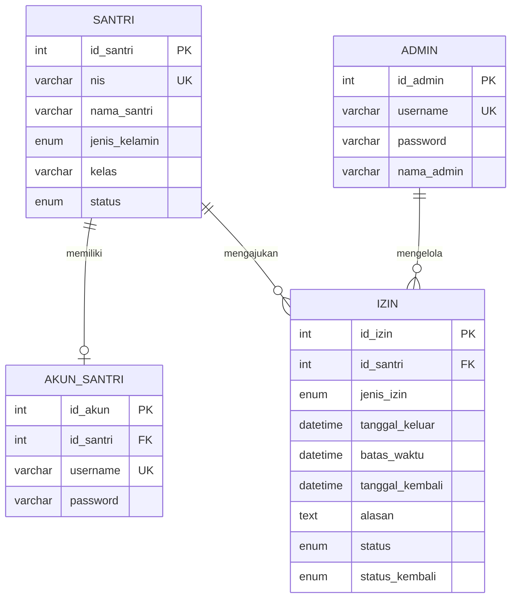
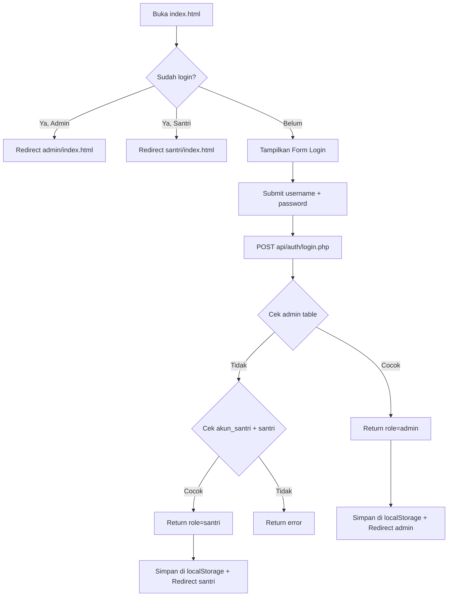
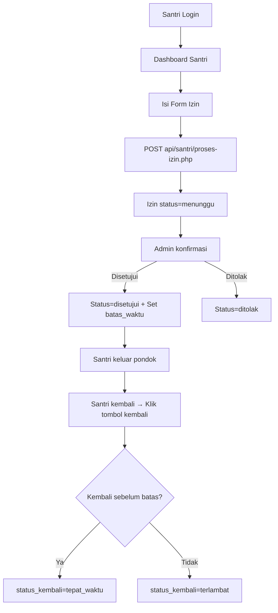

# 📋 Project Review & Analisis — Sistem Perizinan Santri

> **Nama Project:** santri_fitri  
> **Tanggal Review:** 3 April 2026  
> **Reviewer:** AI Code Assistant  
> **Versi:** 1.0

---

## 1. Ringkasan Project

**Sistem Informasi Perizinan Santri** adalah aplikasi web berbasis **PHP Native + HTML/CSS/JS** yang digunakan untuk mengelola proses perizinan santri di **Pesantren Tanwirul Qulub Boka**. Sistem memiliki dua peran utama:

| Role | Deskripsi |
|------|-----------|
| **Admin** | Mengelola data santri, konfirmasi/tolak izin, monitoring kepulangan, rekap data |
| **Santri** | Mengajukan permohonan izin, melihat riwayat izin, konfirmasi kembali ke pondok |

---

## 2. Teknologi yang Dipakai

### 2.1 Backend
| Teknologi | Versi/Detail |
|-----------|-------------|
| **PHP** | Native (tanpa framework) |
| **MySQL/MariaDB** | Database `pesantren` via `mysqli` |
| **Session** | PHP `session_start()` untuk autentikasi server-side |
| **Password Hashing** | `password_hash()` / `password_verify()` (bcrypt) |

### 2.2 Frontend
| Teknologi | Versi/Detail |
|-----------|-------------|
| **HTML5** | Struktur halaman |
| **CSS3** | Inline `<style>` di setiap halaman (tidak modular) |
| **Vanilla JavaScript** | Fetch API, DOM manipulation, localStorage |
| **Font Awesome** | v6.5.0 via CDN untuk icon |

### 2.3 Server / Infrastruktur
| Teknologi | Detail |
|-----------|--------|
| **Web Server** | Apache (`.htaccess` untuk URL rewriting) |
| **Environment** | XAMPP/WAMP (localhost, root tanpa password) |
| **API Format** | REST-like JSON API |
| **Auth Storage** | Hybrid — `$_SESSION` (server) + `localStorage` (client) |

### 2.4 External Dependencies
| Library | Sumber | Penggunaan |
|---------|--------|------------|
| Font Awesome 6.5.0 | CDN (cdnjs) | Ikon UI |
| Segoe UI | System Font | Typography |

---

## 3. Pemetaan Struktur Project

```
santri_fitri/
│
├── .git/                          # Git version control
├── .htaccess                      # Apache URL rewriting rules
├── index.html                     # 🔐 Halaman Login utama (355 baris)
├── register.html                  # 📝 Halaman Registrasi Akun Santri (403 baris)
├── login.php                      # ⚠️ Duplicate login handler (legacy, query ke `akun_admin`)
├── login.js                       # 📜 JavaScript handler login (legacy version)
├── style.css                      # 🎨 Global CSS untuk halaman login (238 baris)
├── test-db.php                    # 🧪 Script test koneksi database
│
├── assets/
│   └── img/
│       ├── logo.png               # 🖼️ Logo pesantren (103KB)
│       └── santri.png             # 🖼️ Gambar dekorasi santri (70KB)
│
├── database/
│   └── pesantren.sql              # 🗄️ SQL schema + data dummy (73 baris)
│
├── admin/                         # 👨‍💼 Panel Admin (Frontend)
│   ├── index.html                 # Dashboard Admin (1463 baris)
│   ├── kelola-santri.html         # CRUD Data Santri (37KB)
│   ├── tambah-santri.html         # Form Tambah Santri (30KB)
│   ├── edit-santri.html           # Form Edit Santri (23KB)
│   ├── konfirmasi.html            # Konfirmasi Perizinan (39KB)
│   ├── monitoring.html            # Monitoring Santri Izin (46KB)
│   ├── rekap.html                 # Rekapitulasi Data (47KB)
│   └── admin-test.html            # Halaman test (248 bytes)
│
├── santri/                        # 🧑‍🎓 Panel Santri (Frontend)
│   ├── index.html                 # Dashboard Santri (1060 baris)
│   └── santri-test.html           # Halaman test (251 bytes)
│
└── api/                           # 🌐 Backend API (PHP)
    ├── check-session.php           # Cek session aktif
    │
    ├── config/
    │   └── database.php            # 🔌 Koneksi database (mysqli)
    │
    ├── auth/                       # 🔐 Autentikasi
    │   ├── login.php               # POST — Login (admin & santri)
    │   ├── register.php            # POST — Registrasi akun santri
    │   ├── logout.php              # Logout (hapus session)
    │   ├── cek-session.php         # Cek session aktif
    │   └── get-santri.php          # GET — Daftar santri tanpa akun
    │
    ├── admin/                      # 👨‍💼 API Khusus Admin
    │   ├── dashboard.php           # GET — Statistik dashboard
    │   ├── santri.php              # GET — List semua santri
    │   ├── santri-detail.php       # GET — Detail santri
    │   ├── tambah-santri.php       # POST — Tambah data santri
    │   ├── edit-santri.php         # POST — Edit data santri
    │   ├── hapus-santri.php        # POST — Hapus data santri
    │   ├── izin-pending.php        # GET — Izin status menunggu
    │   ├── proses-izin.php         # POST — Setujui/tolak izin
    │   ├── izin-proses.php         # GET — Izin yang sudah diproses
    │   ├── monitoring.php          # GET — Data monitoring santri izin
    │   ├── konfirmasi-kembali.php  # POST — Konfirmasi santri kembali
    │   ├── rekap.php               # GET — Rekapitulasi perizinan
    │   ├── stats.php               # GET — Statistik izin
    │   └── test.php                # Test endpoint
    │
    └── santri/                     # 🧑‍🎓 API Khusus Santri
        ├── proses-izin.php         # POST — Ajukan permohonan izin
        ├── izin.php                # GET — Riwayat izin santri
        ├── kembali.php             # POST — Konfirmasi kembali ke pondok
        └── santri-kembali.php      # POST — Alternatif konfirmasi kembali
```

---

## 4. Database Schema

### Database: `pesantren`

#### Tabel `santri`
| Kolom | Tipe | Constraint |
|-------|------|-----------|
| `id_santri` | INT AUTO_INCREMENT | PRIMARY KEY |
| `nis` | VARCHAR(20) | UNIQUE, NOT NULL |
| `nama_santri` | VARCHAR(100) | NOT NULL |
| `jenis_kelamin` | ENUM('L','P') | NOT NULL |
| `kelas` | VARCHAR(20) | NOT NULL |
| `status` | ENUM('aktif','nonaktif') | DEFAULT 'aktif' |
| `created_at` | TIMESTAMP | DEFAULT CURRENT_TIMESTAMP |
| `updated_at` | TIMESTAMP | ON UPDATE CURRENT_TIMESTAMP |

#### Tabel `admin`
| Kolom | Tipe | Constraint |
|-------|------|-----------|
| `id_admin` | INT AUTO_INCREMENT | PRIMARY KEY |
| `username` | VARCHAR(50) | UNIQUE, NOT NULL |
| `password` | VARCHAR(255) | NOT NULL (bcrypt) |
| `nama_admin` | VARCHAR(100) | — |
| `created_at` | TIMESTAMP | DEFAULT CURRENT_TIMESTAMP |

#### Tabel `akun_santri`
| Kolom | Tipe | Constraint |
|-------|------|-----------|
| `id_akun` | INT AUTO_INCREMENT | PRIMARY KEY |
| `id_santri` | INT | FK → `santri(id_santri)` ON DELETE CASCADE |
| `username` | VARCHAR(50) | UNIQUE, NOT NULL |
| `password` | VARCHAR(255) | NOT NULL (bcrypt) |
| `created_at` | TIMESTAMP | DEFAULT CURRENT_TIMESTAMP |

#### Tabel `izin`
| Kolom | Tipe | Constraint |
|-------|------|-----------|
| `id_izin` | INT AUTO_INCREMENT | PRIMARY KEY |
| `id_santri` | INT | FK → `santri(id_santri)` ON DELETE CASCADE |
| `jenis_izin` | ENUM('sakit','acara_keluarga','pulang','lainnya') | NOT NULL |
| `tanggal_keluar` | DATETIME | NOT NULL |
| `batas_waktu` | DATETIME | NULLABLE |
| `tanggal_kembali` | DATETIME | NULLABLE |
| `alasan` | TEXT | — |
| `status` | ENUM('menunggu','disetujui','ditolak') | DEFAULT 'menunggu' |
| `status_kembali` | ENUM('tepat_waktu','terlambat') | NULLABLE |
| `created_at` | TIMESTAMP | DEFAULT CURRENT_TIMESTAMP |
| `updated_at` | TIMESTAMP | ON UPDATE CURRENT_TIMESTAMP |

### ER Diagram (Mermaid)



---

## 5. Alur Aplikasi (User Flow)

### 5.1 Flow Login


### 5.2 Flow Perizinan Santri


---

## 6. Fitur yang Sudah Ada

### Admin Panel ✅
| Fitur | File | Status |
|-------|------|--------|
| Dashboard + Statistik | `admin/index.html` | ✅ Lengkap |
| Kelola Data Santri (CRUD) | `admin/kelola-santri.html` | ✅ Lengkap |
| Tambah Santri | `admin/tambah-santri.html` | ✅ Lengkap |
| Edit Santri | `admin/edit-santri.html` | ✅ Lengkap |
| Konfirmasi Perizinan | `admin/konfirmasi.html` | ✅ Lengkap |
| Monitoring Santri Izin | `admin/monitoring.html` | ✅ Lengkap |
| Rekap Perizinan | `admin/rekap.html` | ✅ Lengkap |
| Export Excel & PDF | `admin/rekap.html` | ✅ Ada tombol |
| Filter & Pagination | `admin/index.html` | ✅ Lengkap |

### Santri Panel ✅
| Fitur | File | Status |
|-------|------|--------|
| Dashboard | `santri/index.html` | ✅ Lengkap |
| Form Pengajuan Izin | `santri/index.html` | ✅ Lengkap |
| Riwayat Perizinan | `santri/index.html` | ✅ Lengkap |
| Konfirmasi Kembali | `santri/index.html` | ✅ Lengkap |
| Tata Tertib & Bantuan | `santri/index.html` | ✅ Lengkap |

### Autentikasi ✅
| Fitur | File | Status |
|-------|------|--------|
| Login (Admin + Santri) | `index.html` + `api/auth/login.php` | ✅ Lengkap |
| Register Santri | `register.html` + `api/auth/register.php` | ✅ Lengkap |
| Logout | `api/auth/logout.php` | ✅ Lengkap |
| Session Check | `api/check-session.php` | ✅ Ada |

---

## 7. Temuan & Catatan Penting

### 🔴 Masalah Keamanan (Critical)

1. **SQL Injection — `login.php` (root)**
   - File `login.php` di root menggunakan query langsung ke tabel `akun_admin` (yang tidak ada di schema) — kemungkinan file legacy/duplikat.
   - Meskipun API utama menggunakan `mysqli_real_escape_string()`, lebih aman menggunakan **prepared statements**.

2. **CORS Terlalu Terbuka**
   ```php
   header('Access-Control-Allow-Origin: *');
   ```
   - Semua API mengizinkan akses dari origin mana saja. Untuk production, harus dibatasi ke domain spesifik.

3. **Autentikasi Hybrid Tidak Konsisten**
   - **Server-side**: Menggunakan `$_SESSION` — benar
   - **Client-side**: Menggunakan `localStorage` — data user disimpan tanpa enkripsi
   - **Masalah**: API admin (`dashboard.php`, `monitoring.php`) mengecek session, tapi frontend mengirim request tanpa memastikan session masih valid → jika session expire tapi localStorage masih ada, user bisa akses halaman tapi API gagal.

4. **Password Dummy Sama Untuk Semua**
   ```sql
   '$2y$10$92IXUNpkjO0rOQ5byMi.Ye4oKoEa3Ro9llC/.og/at2.uheWG/igi'
   -- password: password
   ```
   - Ini hanya untuk development, pastikan diubah untuk production.

5. **Database Config Hardcoded**
   ```php
   $host = 'localhost';
   $username = 'root';
   $password = '';
   ```
   - Credential database di-hardcode. Sebaiknya menggunakan environment variables atau file config terpisah yang tidak masuk git.

### 🟡 Masalah Arsitektur (Medium)

6. **CSS Inline di Setiap File HTML**
   - Setiap file HTML memiliki `<style>` block terpisah dengan banyak duplikasi CSS (sidebar, card, button, dsb). Ini menyulitkan maintenance.
   - **Rekomendasi**: Ekstrak ke 1-2 file CSS global.

7. **File Duplikat / Legacy**
   - `login.php` di root ≠ `api/auth/login.php` — query berbeda (tabel `akun_admin` vs `admin`).
   - `login.js` di root tidak dipakai oleh `index.html` (index.html punya inline JS sendiri).
   - `api/santri/kembali.php` dan `api/santri/santri-kembali.php` — kemungkinan duplikat.
   - `admin-test.html` dan `santri-test.html` — file test kecil yang tidak perlu di production.

8. **Tidak Ada Pagination di API**
   - Semua API query mengembalikan semua data tanpa LIMIT. Jika data besar, ini akan lambat.

9. **Tidak Ada Validasi Input di Client-Side yang Kuat**
   - Form hanya menggunakan `required` attribute HTML. Tidak ada validasi format NIS, panjang password minimal, dll.

### 🟢 Hal Positif (Good)

10. **Struktur API RESTful Sederhana tapi Jelas**
    - Pembagian folder `api/auth/`, `api/admin/`, dan `api/santri/` rapi.

11. **Password Hashing Benar**
    - Menggunakan `password_hash()` dengan `PASSWORD_DEFAULT` (bcrypt).

12. **UI/UX Cukup Baik**
    - Desain green-themed konsisten, ada animasi popup, toast notification, loading spinner, dan responsive design.

13. **Monitoring Real-time**
    - Fitur monitoring bisa mendeteksi santri yang terlambat kembali berdasarkan perbandingan `batas_waktu` dengan `NOW()`.

---

## 8. Rekomendasi Perbaikan

### Prioritas Tinggi 🔴
| No | Item | Detail |
|----|------|--------|
| 1 | Gunakan **Prepared Statements** | Ganti semua `mysqli_query()` dengan `mysqli_prepare()` + `bind_param()` |
| 2 | Batasi CORS | Set `Access-Control-Allow-Origin` ke domain production |
| 3 | Hapus file legacy/duplikat | `login.php`, `login.js` di root, `*-test.html` files |
| 4 | Environment Variables | Pindahkan credential database ke `.env` file |

### Prioritas Sedang 🟡
| No | Item | Detail |
|----|------|--------|
| 5 | Ekstrak CSS | Buat `admin.css` dan `santri.css` yang terpisah dari HTML |
| 6 | Tambah pagination di API | Implementasi LIMIT + OFFSET di query besar |
| 7 | Sinkronkan auth | Pastikan localStorage + session selalu sinkron |
| 8 | Form validation | Tambah validasi client-side (min length password, format NIS) |

### Prioritas Rendah 🟢
| No | Item | Detail |
|----|------|--------|
| 9 | Tambahkan `.gitignore` | Ignore `config/database.php`, `.env`, file test |
| 10 | Separate JS files | Pisahkan inline `<script>` ke file `.js` terpisah |
| 11 | Error logging | Tambahkan logging ke file, bukan expose error ke client |
| 12 | HTTPS enforcement | Tambahkan redirect HTTP → HTTPS di `.htaccess` |

---

## 9. Statistik File

| Kategori | Jumlah File | Total Size |
|----------|-------------|------------|
| HTML (Frontend) | 11 | ~277 KB |
| PHP (API) | 19 | ~20 KB |
| CSS | 1 | 4 KB |
| JavaScript | 1 | 4 KB |
| SQL | 1 | 3 KB |
| Images | 2 | ~174 KB |
| Config | 2 | ~384 bytes |
| **Total** | **37 file** | **~482 KB** |

---

## 10. Kesimpulan

Sistem Perizinan Santri ini merupakan **aplikasi web PHP native yang fungsional dan cukup lengkap** untuk kebutuhan pengelolaan izin santri di pesantren. Fitur-fitur inti sudah berjalan — mulai dari login, pengajuan izin, konfirmasi oleh admin, monitoring, hingga rekap.

**Kekuatan utama:**
- Fitur lengkap end-to-end
- UI cukup modern dan responsif
- Alur bisnis jelas dan terstruktur

**Area perbaikan utama:**
- Keamanan (SQL injection, CORS, credential management)
- Maintainability (CSS/JS inline, file duplikat)
- Skalabilitas (pagination, error handling)

Project ini cocok untuk skala **pesantren kecil-menengah** dan bisa diperluas dengan menambahkan fitur seperti notifikasi WhatsApp, dashboard analitik, atau multi-admin.
